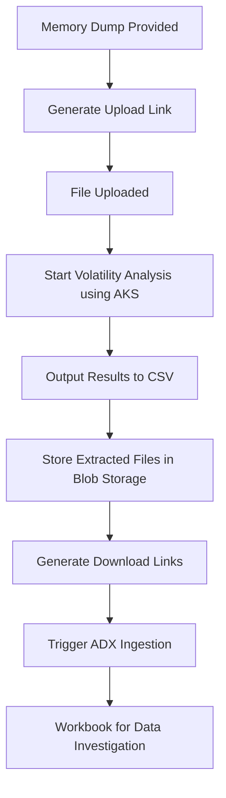

# AjourVolAutolity Setup using Bicep Deployment

## Goal

We aim to establish an automated process for Memory Forensic analysis, from file upload to output in Azure Data Explorer (ADX). Every step should be meticulously automated.

## Requirements

After a memory dump is provided, the process should:
- Spin up an environment that can be easily destroyed once analysis is complete.
- Automatically generate a link for file upload.
- Once the file upload is complete:
    - Begin analysis using Volatility scripts.
    - Output results into CSV files.
    - Make extracted files available in a blob storage:
        - Each file should have a downloadable link for further inspection.
        - A CSV listing all files with their respective download links should be generated.
- Trigger ADX to ingest these files.
- Provide a workbook to auto-investigate or explore the available data.

## Roles Needed

- **Azure Administrator**: To manage and configure Azure resources.
- **Security Analyst**: To interpret the forensic analysis results. (nope, we only need access to the ADX, and then we should be able to downloading the files from the share - which will be open for all asking for access by a simple one-time download link or similar)
- **DevOps Engineer**: To automate the deployment and teardown of environments.
- **Data Engineer**: To handle data ingestion and processing in ADX.

## Preferred Setup

Based on the evaluation of the proposed tech stacks, the preferred setup is as follows:
- **Azure Blob Storage**: For storing memory dumps and analysis results.
- **Azure Event Grid**: To trigger workflows based on file uploads.
- **Azure Kubernetes Service (AKS)**: To run Volatility analysis scripts in a scalable manner.
- **ADX (Azure Data Explorer)**: For ingesting and analyzing the results.
- **Azure Logic Apps**: To automate the overall workflow and integrate various services.

## Process Flow



## File Structure Setup for This Project

```mermaid
.
├── infra
│   ├── main.bicep
│   ├── storage.bicep
│   ├── aks.bicep
│   ├── eventgrid.bicep
│   ├── adx.bicep
│   └── logicapps.bicep
├── scripts
│   ├── volatility_analysis.py
│   ├── upload_handler.py
│   └── data_ingestion.py
├── workflows
│   ├── file_upload_workflow.json
│   ├── analysis_workflow.json
│   └── ingestion_workflow.json
├── [README.md]
└── .gitignore
```

## Example Workflow

1. **File Upload**:
    - A memory dump is uploaded to Azure Blob Storage.
2. **Trigger Analysis**:
    - An event (e.g., file upload) triggers an Azure Function or Logic App to start the analysis process using Volatility scripts running on AKS.
3. **Store Results**:
    - The analysis results are stored as CSV files in Azure Blob Storage.
4. **Data Movement**:
    - ADF orchestrates the movement of these CSV files from Blob Storage to ADX.
5. **Data Ingestion**:
    - ADX ingests the CSV files and makes the data available for querying and analysis.
6. **Data Investigation**:
    - Security analysts use ADX to query and visualize the data, leveraging the power of Kusto Query Language and integrated workbooks for detailed investigation.
7. **Reporting**:
    - Nothing here yet.
8. **Removing Data**:
    - Once investigation and reporting has been done, we should delete the data.


TODO: Set Up Azure Data Factory (ADF):
This will orchestrate the data flow from Blob Storage to ADX.
Create the Bicep template for the Data Factory.

Set Up ADX (Azure Data Explorer):
This will ingest and analyze the results.
Create the Bicep template for the ADX cluster and database.
Set Up Logic Apps:

This will automate the overall workflow and integrate various services.
Create the Bicep template for the Logic Apps.
Create Scripts:

Develop the necessary scripts for analysis, upload handling, and data ingestion.
Create Workflows:

Define the workflows for file upload, analysis, and ingestion.


# Requirements
Install kubectl - https://kubernetes.io/docs/tasks/tools/install-kubectl-windows/
Az CLI


# Manual setup:
## Storage Account
