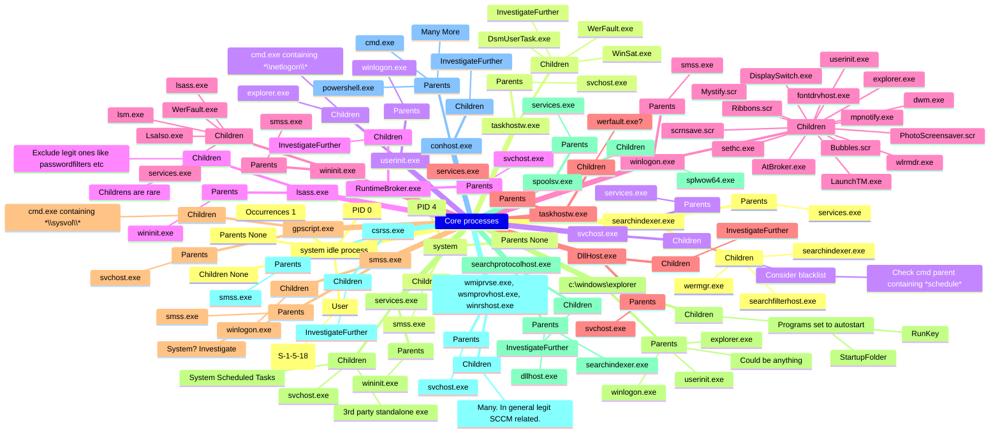

# AjourVolAutolity
## Project Goal

The goal of this project is to:
- Leverage the power of the cloud
- Automate volatility commands
- Speed up the process from acquisition to analysis
- Utilize the speed of KQL to quickly analyze large datasets
- Spend more time on important tasks rather than repetitive commands

This setup allows us to upload multiple dumps, with each Volatility session linked to its respective dump stored in a separate database.

> [!NOTE]  
> This is a work in progress with many planned additions and improvements. Contributions and suggestions are welcome. Currently, the focus is limited to Windows. For safety, consider using Azure Sandbox Landingzones, which includes separate subscriptions and resource groups.

### Workflow

The analyst initiates the Terraform setup and sends upload links/commands to the person acquiring the images. Once the images are uploaded, the analyst starts querying the data. This process is hands-off from upload to querying.

## Parent-Child Relations

Understanding known good processes is crucial for analyzing memory dumps. Below is an overview that is periodically updated.



## Setup Process and "How To"

### Requirements

#### Azure Roles
- **AllDatabasesAdmin**: Required to read, view, and write to the ADX cluster.
- **Contributor**: Required on the cluster.
- **Admin**: Required on the database.
- **CloudApplicationAdmin**: Not covered in code.

#### Installation and Login

1. **Install Terraform**: [Terraform Installation Guide](https://developer.hashicorp.com/terraform/install#Windows)
2. **Install Azure CLI**: [Azure CLI Installation Guide](https://learn.microsoft.com/en-us/cli/azure/install-azure-cli-windows?tabs=winget)

3. **Generate SSH Key**:
    ```sh
    ssh-keygen -t rsa
    ```

4. **Login and Set Subscription**:
    ```powershell
    az login
    # Alternative login
    az login --use-device-code
    az account set --subscription "<INSERT SUBSCRIPTION ID OR NAME>"
    ```

### Deployment Steps
1. Optional: Set variables in `variable.tf` for your initials, etc.
2. Navigate to the project's root directory.
3. Optional: Add memory dumps to `./VolAutolity/sample/` folder or upload them after setup.
4. Initialize and apply Terraform:
    ```powershell
    terraform init
    terraform plan -var="subscription_id=your_subscription_id" -var="username=computerUsername"
    terraform apply -var="subscription_id=your_subscription_id" -var="username=computerUsername" [-auto-approve]
    ```


### Memory Dump Naming Convention

- **os**: win, linux, or osx
- **companyName**: Any name, e.g., Adrian221024
- **extension**: dd, raw, mem, vmem, etc.

### Upload Functionality

Trigger the event by copying or moving the file to the upload location. This triggers kernel signals that activate `inotifywait`.

### Investigator Instructions

Send the investigator the necessary details to sign in and upload the dump. The investigator must be a registered user in the current tenant.

```powershell
terraform output setup_and_instructions
```

## Challenges and Bugs

- Uploading multiple images simultaneously yields poor results. Recommend uploading one at a time.
- Azure CLI errors can often be resolved by:
    ```powershell
    az ad signed-in-user show
    az logout
    az login
    az ad signed-in-user show
    az config set auto-upgrade.enable=yes
    ```

- The setup is not idempotent. Sometimes requires multiple runs.
- Random errors like "Error: retrieving Subscription <...>" and "Error: remote-exec provisioner error" may occur. Re-running usually fixes these issues.

## Memory Dumps for Testing

- [MemLabs](https://github.com/stuxnet999/MemLabs/tree/master/Lab%200)
- [Volatility Workbench](https://www.osforensics.com/tools/volatility-workbench.html)
- [Africa-DFIRCTF-2021-WK02](https://archive.org/details/Africa-DFIRCTF-2021-WK02)

## Time Notes

- ADX cluster setup: ~15 minutes
- VM setup: ~16 seconds
- Null resource setup: ~8 minutes
- Total: ~24 minutes

## Screenshots


## Resources

<details><summary>Click to expand</summary>
<ul>
<li>https://github.com/hashicorp/terraform-provider-azurerm/issues/15649</li>
<li>https://learn.microsoft.com/en-us/azure/data-explorer/create-cluster-database?tabs=azcli</li>
<li>https://learn.microsoft.com/en-us/cli/azure/authenticate-azure-cli-managed-identity</li>
<li>https://azure-training.com/azure-data-science/creating-the-adx-environment/creating-adx-environment-using-cli/</li>
<li>https://learn.microsoft.com/en-us/azure/data-explorer/create-cluster-database?tabs=azcli#create-an-azure-data-explorer-database</li>
<li>https://learn.microsoft.com/en-us/cli/azure/kusto/database?view=azure-cli-latest#az-kusto-database-update(kusto)</li>
<li>https://learn.microsoft.com/en-us/azure/data-explorer/python-ingest-data</li>
<li>https://github.com/Azure/azure-kusto-python/blob/master/azure-kusto-ingest/tests/sample.py</li>
<li>https://registry.terraform.io/providers/hashicorp/azurerm/latest/docs/guides/managed_service_identity</li>
<li>https://registry.terraform.io/providers/hashicorp/azuread/latest/docs/resources/service_principal_password</li>
<li>https://registry.terraform.io/providers/favoretti/adx/latest/docs</li>
<li>https://registry.terraform.io/providers/hashicorp/azurerm/latest/docs/resources/user_assigned_identity</li>
<li>https://pypi.org/project/azure-kusto-ingest/</li>
<li>https://learn.microsoft.com/en-us/dotnet/core/install/linux-scripted-manual#scripted-install</li>
<li>https://www.nuget.org/packages/Microsoft.Azure.Kusto.Tools/#releasenotes-body-tab</li>
<li>https://learn.microsoft.com/en-us/azure/data-explorer/kusto/tools/kusto-cli</li>
<li>https://thelearningjourneyebooks.com/</li>
<li>https://github.com/vavarachen/volatility_automation</li>
<li>https://linux.die.net/man/1/inotifywait</li>
<li>https://github.com/volatilityfoundation/volatility3/blob/develop/vol.py</li>
<li>https://downloads.volatilityfoundation.org/releases/2.4/CheatSheet_v2.4.pdf</li>
<li>https://learn.microsoft.com/en-us/azure/data-explorer/kusto/management/data-ingestion/ingest-from-storage</li>
<li>https://github.com/search?q=repo%3AAzure%2Fazure-sdk-for-python%20ingest&type=code</li>
<li>https://github.com/Azure/azure-kusto-python/blob/master/azure-kusto-ingest/tests/sample.py</li>
<li>https://github.com/Azure/azure-kusto-python</li>
<li>https://www.techbrothersit.com/2022/02/how-to-create-single-or-multiple-tables.html</li>
<li>https://ansibledaily.com/execute-detached-process-with-ansible/</li>
<li>https://www.huuhka.net/devops-for-azure-workbooks/</li>
<li>https://learn.microsoft.com/en-us/azure/data-explorer/kusto/query/geospatial-visualizations</li>
<li>https://learn.microsoft.com/en-us/azure/azure-monitor/visualize/workbooks-tree-visualizations</li>
<li>https://github.com/Dead-Simple-Scripts/AutoVol-SDF-Memory-Forensics-2/blob/master/autovol_mem2_example.sh</li>
<li>https://github.com/Yara-Rules/rules</li>
<li>https://github.com/k1nd0ne/VolWeb</li>
<li>https://github.com/carlospolop/autoVolatility</li>
<li>https://learn.microsoft.com/en-us/azure/data-explorer/kusto/query/visualization-timepivot?pivots=azuredataexplorer</li>
<li>https://learn.microsoft.com/en-us/azure/data-explorer/kusto/query/visualization-linechart?pivots=azuredataexplorer</li>
<li>https://www.cloudsma.com/2021/01/azure-workbooks-icons-thresholds-heatmaps/</li>
<li>https://learn.microsoft.com/en-us/azure/data-explorer/kusto/query/visualization-treemap?pivots=azuredataexplorer</li>
<li>https://learn.microsoft.com/en-us/azure/azure-monitor/visualize/workbooks-grid-visualizations</li>
<li>https://reversea.me/index.php/writing-a-volatility-3-plugin/</li>
<li>https://hostingjournalist.com/how-to-build-tabs-and-alerts-in-azure-workbooks-azure-portal-series/</li>
<li>https://hostingjournalist.com/how-to-build-tabs-and-alerts-in-azure-workbooks-azure-portal-series/</li>
</ul>
</details>

## Notes on Decisions

- PSTree is generated in the workbook instead of being run directly.

## Community Questions

Is there a secure way to run an image with known malicious files? How can we sandbox this environment for safe scanning and analysis? Can we perform deeper analysis of malicious files with dynamic/static analysis, and what would that setup look like?

