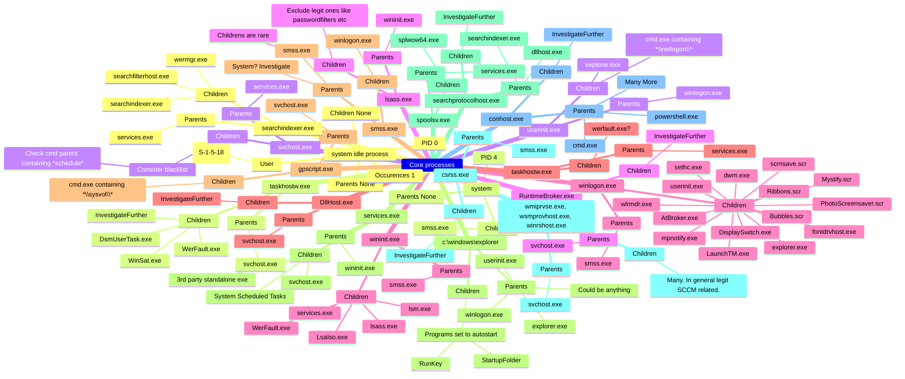
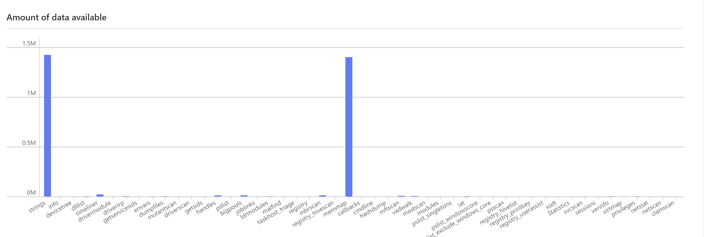
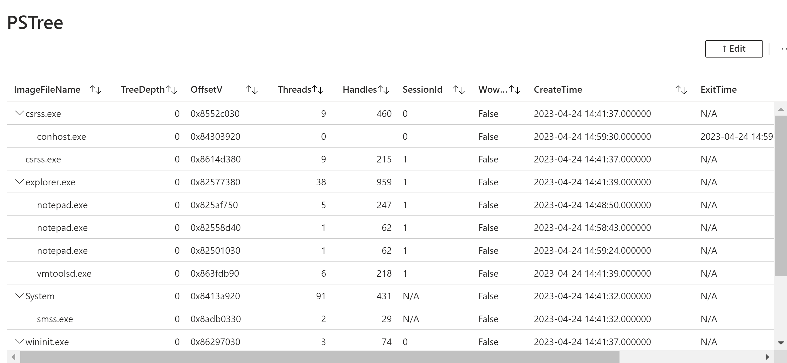
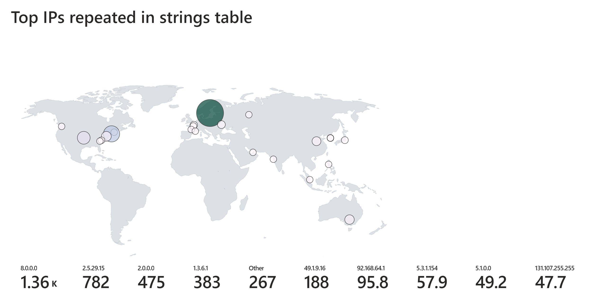
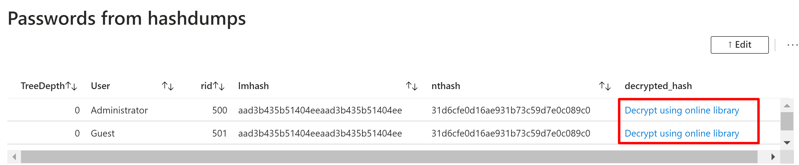
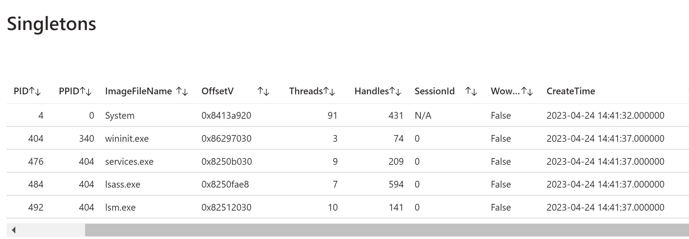

# AjourVolAutolity

## Goal of the project
The goal of this project is
- leveraging power of the cloud, 
- automate the volatility commands,
- speed up the process from acquisition-end to analysis-start,
- utilizing the speed of KQL to find answers quickly on large data sets,
- spend time doing more important stuff than running a bunch of commands on repeat!

This is set up in such a way that allows us to upload as many dumps as we need to. Every Volatility session will be linked with it's dump which will be stored into it's own separate database.

> [!NOTE]  
> This is a work in progress with a lot of additions and improvements already planned. If you want to contribute - please feel free to do so. Suggestions are also very welcome. Currently limited to focus only on Windows.
> To keep this most safe, you should consider abiding to Azure Sandbox Landingzones which includes separate subscription, resource group (everything in this project is already a separate resource group) and more.

### Workflow 
The analysor spins up the terraform setup, sends the uploading links/commands to the person acquiring the image(s), who then uploads. The analysor waits until ingestion has been made and starts actively querying the data. Hands-off from upload to querying.

## Parent Child relations
An important part of knowing how to analyse memory dumps is to be aware of known goods. I've created this overview which i tend to analyse and update from time to time. 



# Process of setting it up and "How to"
## Requirements
### Roles in Azure
You need "AllDatabasesAdmin" role to be able to read, view and write to the ADX cluster. And to create everything there are a lot of others as well - I have currently been a root tenant owner.

To run scripts on database you need Contributor role on the cluster and Admin role on the database - Pretty much covered.

CloudApplicationAdmin is per now not covered in code.

As root tenant owner you don't need any other permissions/roles as far as my testing goes.

### Install and login
 
Install Terraform: https://developer.hashicorp.com/terraform/install#Windows 

Install Azure CLI: https://learn.microsoft.com/en-us/cli/azure/install-azure-cli-windows?tabs=winget

Login and set subscription:
```powershell
az login # Prompts you interactively via last opened browser and spits out all available subscriptions for your user
az account set --subscription "<INSERT SUBSCRIPTION ID OR NAME>"
```

## Steps to deploy

Set the variable for your initials, path to your public and private SSH-keys in variable.tf (and more as needed).

Navigate to the root directory of the project.

```powershell
terraform init
terraform plan
terraform apply [-auto-approve]
```

Important note to the uploader/investigator: the dump file follows a naming convention: os_anythin.ext. To figure out the best fit for which modules to run I decided to use this approach. An example would be: win_myCompany130224.dd. The available values are: "win", "linux" or "osx". Current set of accepted extensions are limited ("dd" "raw" "mem" "vmem"), but easily extended to whatever Volatility3 accepts.

If you want to make the analysis on a dump you already have, apply the full terraform config with the dump inside ./VolAutolity/sample/ folder. As this operation includes a copy to the memorydumps location that is mointored, nothing more is needed. If you are using upload functionality - you need to trigger the event by copying or moving the file into the same location it was uploaded to as it will trigger some kernel signals that triggers inotifywait. I'm working on a solution to make it run once a blob has been uploaded from elsewhere. Any input or solution is appreciated as all of this is fairly new to me!

Send the investigator the necessary details to sign in to correct location and then upload the dump. The investigator needs to have a registered user in the current tenant to use the az cli uploading functionality (SAS token url is work in progress): Get the list of commands by entering:
```powershell
terraform output setup_and_instructions
```

## Challenges and bugs
Doing too many images at the same times yields poor result in current state as they are running concurrently. Recommend uploading one and one and doing sample-folder for max 2. 

I've stumbled upon a few errors using Azure CLI that was unreproducable but was most often solved by this flow of commands:

```powershell
az ad signed-in-user show
az logout
az login
az ad signed-in-user show
az config set auto-upgrade.enable=yes
```

This setup is not idempotent as we are using provisioners like Ansible to push out our setup. Sometimes you need to run the setup twice to make it work like intended. Sometimes the null_resource takes forever, which I have made successfully run simply by pressing CTRL+C (quitting) and then re-running the apply process.

A bug with errors: "Error: retrieving Subscription <...> stream error: stream ID 3; CANCEL; received from peer" may occur, re-running has been the fix for this and seem to appear randomly for many users when researching the topic.

"Error: remote-exec provisioner error" Sometimes happen. Try a re-run with this error as well. 

# Memory dumps for testing
https://github.com/stuxnet999/MemLabs/tree/master/Lab%200
https://www.osforensics.com/tools/volatility-workbench.html 
https://archive.org/details/Africa-DFIRCTF-2021-WK02 


## Time notes (give or take)
ADX cluster often takes around 15 minutes setting up. 
VM with size Standard_DS1_v2 takes about 16 seconds, but adding the null_resource (installation of apps and more) takes a total of 8 min.

Completes most often within 30 minutes for everything.

## Screenshots










And much more on the way...

<details><summary>Resources: </summary>
<ul>
<li>https://github.com/hashicorp/terraform-provider-azurerm/issues/15649</li>
<li>https://learn.microsoft.com/en-us/azure/data-explorer/create-cluster-database?tabs=azcli </li>
<li>https://learn.microsoft.com/en-us/cli/azure/authenticate-azure-cli-managed-identity</li>
<li>https://azure-training.com/azure-data-science/creating-the-adx-environment/creating-adx-environment-using-cli/</li>
<li>https://learn.microsoft.com/en-us/azure/data-explorer/create-cluster-database?tabs=azcli#create-an-azure-data-explorer-database</li>
<li>https://learn.microsoft.com/en-us/cli/azure/kusto/database?view=azure-cli-latest#az-kusto-database-update(kusto)</li>
<li>https://learn.microsoft.com/en-us/azure/data-explorer/python-ingest-data</li>
<li>https://github.com/Azure/azure-kusto-python/blob/master/azure-kusto-ingest/tests/sample.py</li>
<li>https://registry.terraform.io/providers/hashicorp/azurerm/latest/docs/guides/managed_service_identity</li>
<li>https://registry.terraform.io/providers/hashicorp/azuread/latest/docs/resources/service_principal_password</li>
<li>https://registry.terraform.io/providers/favoretti/adx/latest/docs</li>
<li>https://registry.terraform.io/providers/hashicorp/azurerm/latest/docs/resources/user_assigned_identity</li>
<li>https://pypi.org/project/azure-kusto-ingest/</li>
<li>https://learn.microsoft.com/en-us/dotnet/core/install/linux-scripted-manual#scripted-install</li>
<li>https://www.nuget.org/packages/Microsoft.Azure.Kusto.Tools/#releasenotes-body-tab</li>
<li>https://learn.microsoft.com/en-us/azure/data-explorer/kusto/tools/kusto-cli</li>
<li>https://thelearningjourneyebooks.com/</li>
<li>https://github.com/vavarachen/volatility_automation</li>
<li>https://linux.die.net/man/1/inotifywait</li>
<li>https://github.com/volatilityfoundation/volatility3/blob/develop/vol.py</li>
<li>https://downloads.volatilityfoundation.org/releases/2.4/CheatSheet_v2.4.pdf</li>
<li>https://learn.microsoft.com/en-us/azure/data-explorer/kusto/management/data-ingestion/ingest-from-storage</li>
<li>https://github.com/search?q=repo%3AAzure%2Fazure-sdk-for-python%20ingest&type=code</li>
<li>https://github.com/Azure/azure-kusto-python/blob/master/azure-kusto-ingest/tests/sample.py</li>
<li>https://github.com/Azure/azure-kusto-python</li>
<li>https://www.techbrothersit.com/2022/02/how-to-create-single-or-multiple-tables.html</li>
<li>https://ansibledaily.com/execute-detached-process-with-ansible/</li>
<li>https://www.huuhka.net/devops-for-azure-workbooks/</li>
<li>https://learn.microsoft.com/en-us/azure/data-explorer/kusto/query/geospatial-visualizations</li>
<li>https://learn.microsoft.com/en-us/azure/azure-monitor/visualize/workbooks-tree-visualizations</li>
<li>https://github.com/Dead-Simple-Scripts/AutoVol-SDF-Memory-Forensics-2/blob/master/autovol_mem2_example.sh</li>
<li>https://github.com/Yara-Rules/rules</li>
<li>https://github.com/k1nd0ne/VolWeb</li>
<li>https://github.com/carlospolop/autoVolatility</li>
<li>https://learn.microsoft.com/en-us/azure/data-explorer/kusto/query/visualization-timepivot?pivots=azuredataexplorer</li>
<li>https://learn.microsoft.com/en-us/azure/data-explorer/kusto/query/visualization-linechart?pivots=azuredataexplorer</li>
<li>https://www.cloudsma.com/2021/01/azure-workbooks-icons-thresholds-heatmaps/</li>
<li>https://learn.microsoft.com/en-us/azure/data-explorer/kusto/query/visualization-treemap?pivots=azuredataexplorer</li>
<li>https://learn.microsoft.com/en-us/azure/azure-monitor/visualize/workbooks-grid-visualizations</li>
<li>https://reversea.me/index.php/writing-a-volatility-3-plugin/</li>
<li>https://hostingjournalist.com/how-to-build-tabs-and-alerts-in-azure-workbooks-azure-portal-series/</li>
<li>https://hostingjournalist.com/how-to-build-tabs-and-alerts-in-azure-workbooks-azure-portal-series/</li>
</ul>
</details>

## Notes on a few decisions
PSTree is not being run, but produced in workbook instead.

## Questions for the community:
Is there a downside running an image with known malicious files within it - is there a secure way to do so? Within a separate subscription? And how do we sandbox this environment enough to make it safe to scan and analyze anything either via Volatility completely or by SSH/VNC into the machine for deeper analysis? Can we go deeper in analysis of found malicious files with dynamic/static analysis, and how should a setup like that look like?