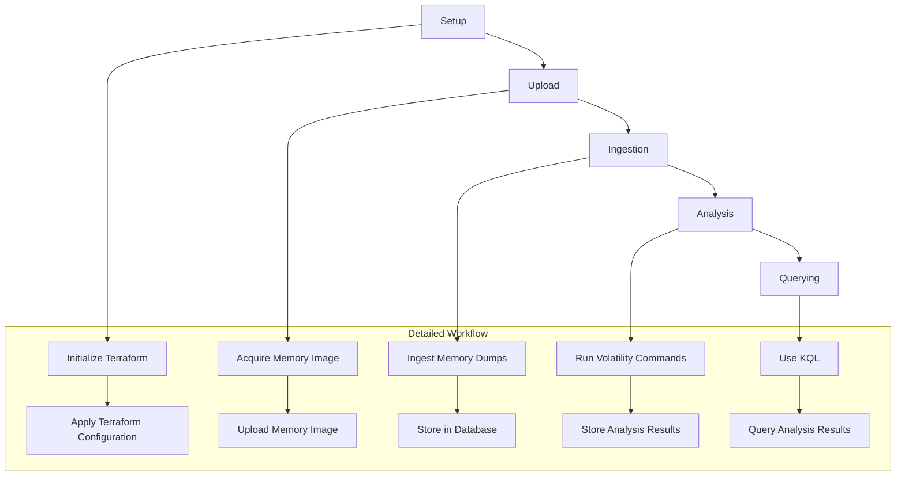

Design Document for AjourVolAutolity
# Project Overview

## Goal of the Project

The primary goal of the AjourVolAutolity project is to automate the process of analyzing memory dumps using Volatility, leveraging the power of the cloud to speed up the process from acquisition to analysis. This project aims to:

- Automate volatility commands.
- Speed up the process from acquisition-end to analysis-start.
- Utilize the speed of KQL (Kusto Query Language) to quickly find answers in large datasets.
- Allow users to focus on more important tasks rather than running repetitive commands.

## Benefits

- **Automation**: Reduces manual intervention, making the process faster and more efficient.
- **Scalability**: Leverages cloud infrastructure to handle large volumes of data.
- **Efficiency**: Speeds up the analysis process, allowing quicker insights.
- **Focus**: Allows analysts to spend more time on critical tasks rather than repetitive ones.

## Requirements

### Functional Requirements

- **Upload Memory Dumps**: Ability to upload multiple memory dumps.
- **Automated Analysis**: Automate the execution of Volatility commands on the uploaded dumps.
- **Data Storage**: Store each memory dump and its analysis results in a separate database.
- **Querying**: Use KQL to query the analysis results efficiently.
- **Role-Based Access**: Implement role-based access control to ensure secure operations.

### Non-Functional Requirements

- **Performance**: The system should handle large datasets efficiently.
- **Scalability**: The system should scale with the number of memory dumps and analysis tasks.
- **Security**: Ensure data security and compliance with Azure Sandbox Landingzones.

## Azure Roles and Permissions

To ensure secure and efficient operations, the following Azure roles are required:

- **Owner**: Full access to all resources, including the right to delegate access to others.
- **Contributor**: Can create and manage all types of Azure resources but cannot grant access to others.
- **Reader**: Can view existing Azure resources.
- **Storage Blob Data Contributor**: Can manage and read blob storage containers and data.

## Workflow

### High-Level Workflow

1. **Setup**: The analyst sets up the Terraform configuration.
2. **Upload**: The person acquiring the memory image uploads it using the provided links/commands.
3. **Ingestion**: The system ingests the uploaded memory dumps.
4. **Analysis**: The system automatically runs Volatility commands on the ingested dumps.
5. **Querying**: The analyst queries the analysis results using KQL.

### Detailed Workflow Diagram

## Running the Project

### Prerequisites

- Azure subscription with appropriate roles.
- Terraform installed locally.
- Ansible installed locally.

### Steps to Run

1. **Setup Terraform**: Initialize and apply the Terraform configuration.
2. **Configure Ansible**: Update the Ansible configuration files as needed.
3. **Upload Memory Dumps**: Use the provided upload links/commands to upload memory dumps.
4. **Automated Analysis**: The system will automatically run Volatility commands on the uploaded dumps.
5. **Query Results**: Use KQL to query the analysis results.

## Conclusion

The AjourVolAutolity project aims to streamline and automate the process of analyzing memory dumps, leveraging cloud infrastructure to enhance efficiency and scalability. By automating repetitive tasks and utilizing KQL for querying, the project allows analysts to focus on more critical tasks, ultimately speeding up the analysis process and providing quicker insights.